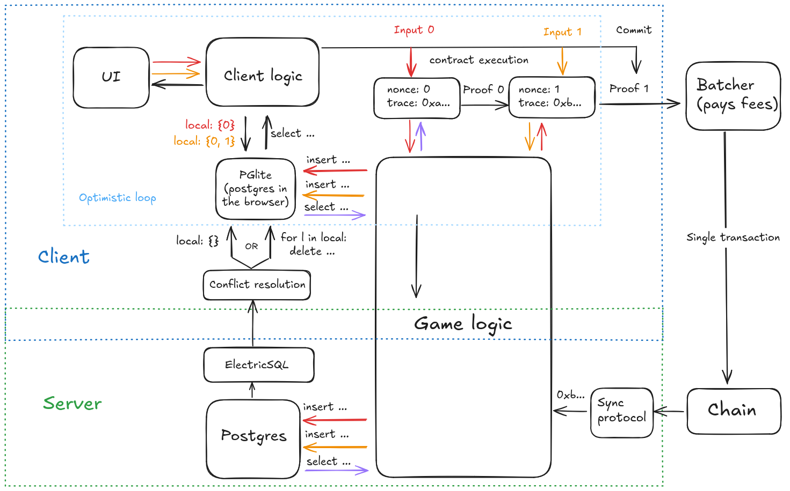

# About

This repo has a prototype for an architecture to index games built with
recursive SNARKs that can run optimistically in the browser.

The main motivation is to be able to re-use the logic in both the client and the
server. Since the entire state is stored in a Postgres database, this means
running an instance of PGLite (Postgres in wasm) in the browser, that replicates
the data relevant to the current player from the server-side instance of
Postgres.

## Overview



**NOTE**: There are some simplifications in the chart. For example, some
transaction failures may be detected by the batcher, in which case the rollback
will happen before.

## Model

Recursive SNARKs allow batching multiple game actions into a single proof,
without needing to submit any of the intermediate steps to a network. This helps
with latency/fluency, since it reduces the number of submissions to the network
(which are slow).  But it requires being able to run the game logic on the
client first and then on the server.

## Inputs

Conceptually the system will consume contract calls (traces) as inputs, where
each input is transformed into a set SQL queries (that can also read the current
db state). The client applies this set of queries over it's own replica of the
db. Eventually (after the client decides to submit) the server sees the same
sequence of inputs, and runs the same queries on its own state.

## Replication

1. The client registers the set of tables that it wants to replicated from the
server.
2. The client replicates the initial state of the relevant tables.
3. The client monitors the `input` table in live mode. It's important to monitor
a table that would always be updated, because we use long polling for this
table, which means we'll block waiting if there is no update. We also store the
greatest *postgres txid* that we get at this stage.
4. When an update to the `input` table is received, we request updates for all
of the other tables but not in live mode, so that we get immediate response. We
can do this because we process blocks in a single transaction in the backend.

*NOTE*: at this stage we could get data from transactions for which we didn't
get the initial data (step 3). We ignore those txs but keep the data in memory
to consolidate in the next round.

5. Changes across all the tables are grouped by transaction and applied to the
database. We use `SET session_replication_role TO replica` to disable foreign
key constraints so that we don't need to figure out the right orderings.

## Local writes (conflict resolution).

Local writes are done to the same tables that are kept in sync. We can check
consistency by keeping the data flow insert-only (enforced by the event id).

When we receive updates (inserts) from the ElectricSQL server, we can check if
we already have that same exact row (by checking all the columns). Then if for
some reason the data inserted in the backend differs from the local row, we can
do a rollback of the local-only state. This is the main reason we need to use
inserts only, because that way we get the full row and can detect conflicts. 

To keep track of local-only state we can have a trigger on the tables, so that.
when we do an insert we add that `event_id` to a table that keeps only local.
events. Since we disable triggers when replicating, we don't need special
handling in that case, and this way the game logic doesn't need to change for
the client.

Then when a rollback is needed we get all the events id from local events table,
and delete everything related to these.

**NOTE:** There could be other state that needs to be rollbacked that may not be
stored in the db (player position, etc).

#### Deletes

For data for which we only want to keep a single entry (a value that gets
updated), we can do the deletions in the **backend only**.

Then an update will consist of an insert followed by a delete of the previous
value. The reason for this is that since the client won't do the deletes, it
will have the previous entry in order to check for conflicts. But the end result
is that intermediate entries eventually get deleted.

#### Sets

If for some reason we want to keep track of a mutable set (or some other complex
structure), one way is to serialize the structure and keep it in column in
binary/json form.

If the data set is too big for that, then an option is to keep two sets, one
with additions and another one with deletions, and have queries check both
tables.

## Demo/prototype

The demo code is chain and server agnostic. Steps to run it (each in its own
terminal):

```
docker compose up
```

```
deno run dev
```

```
cd browser-test
npm run dev
```

Navigate to http://localhost:5173/  

The inputs are strings of the form:

`var1:value1|var2:value2|...|varn:valuen`.

In a real application the inputs to the system would be the result of smart
contract execution (traces).

The full text is stored in the `input` table, which also has two extra identifiers:

`player_id`: a number that identifies a player (doesn't need to be a number).
`event_id`: a numeric per-player nonce.

The `player_id` is needed so that we can only replicate the subset of the state
relevant to a certain player.

The `event_id` is a nonce with must be increased with every contract action.

The input is then split by `|` and the results are stored in a table that acts
as a dictionary, this (domain) logic is shared between the backend and frontend.
The backend also takes care of removing old entries.

**NOTE:** This code will probably have to be moved to either a template, or some
*part of it to a lib in paima.